# Bowling Club – System Rezerwacji Kręgielni

**Bowling Club** to aplikacja webowa umożliwiająca użytkownikom rejestrację, logowanie oraz dokonywanie rezerwacji torów do gry w kręgle. Projekt został zbudowany w architekturze MVC i zorganizowany zgodnie z zasadami SOLID, KISS i DRY, z pełnym wsparciem dla rozwoju obiektowego i skalowalności. Zastosowano również wzorzec Singleton do zarządzania kluczowymi komponentami, takimi jak połączenia z bazą danych.

## 🎨 Interfejs użytkownika

Strona startowa aplikacji zawiera panel logowania podzielony na dwie części – po lewej stronie widoczna jest grafika z logo kręgielni, natomiast po prawej znajduje się formularz logowania. Aplikacja jest w pełni responsywna – widok mobilny automatycznie dostosowuje się do rozmiaru ekranu, przenosząc elementy menu do dolnej części oraz aktywując burger menu do ich rozwijania.

Panel rejestracji zawiera pola z danym do uzupełnienia przez użytkownika. Dane zbierane to Imię, Nazwisko, Login, Email, Hasło oraz Rola do wybrania. Login oraz Email muszą być unikatowe i jeżeli podane przez użytkownika nie są, to zostanie poproszony o ponowne wpisanie nowej wartości.

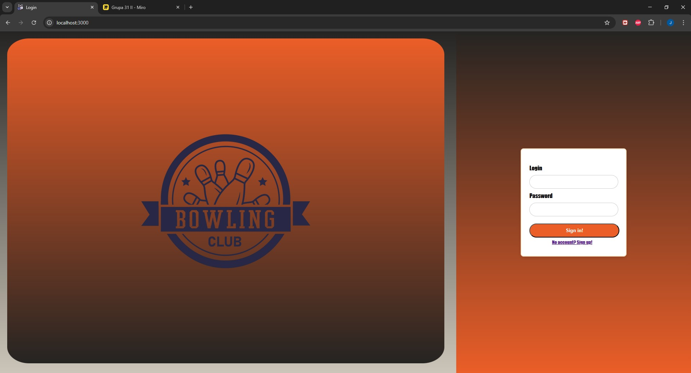
*Widok logowania na desktopie*

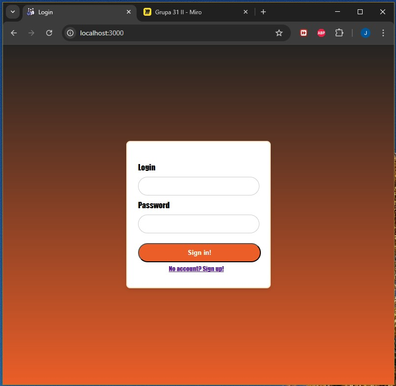
*Widok logowania w wersji mobilnej*

## 🔐 System logowania i ról

Użytkownik po utworzeniu konta może zalogować się do systemu. Hasła przechowywane są w formie bezpiecznych hashy. Każdy użytkownik może posiadać wiele ról (relacja wiele-do-wielu), co umożliwia elastyczne zarządzanie uprawnieniami i rozwój systemu w przyszłości. Domyślnie dostępne role to:

- `Guest` – użytkownik bez konta lub niezalogowany,
- `Employee` – pracownik,
- `Admin` – administrator systemu.

Po zalogowaniu, użytkownik zostaje przekierowany do głównego widoku harmonogramu rezerwacji.

## 📅 Harmonogram rezerwacji

Centralną funkcją aplikacji jest harmonogram, z terminami dostępnmi od poniedziałku do niedzieli. Godziny otwarcia są dostosowane dynamicznie, w zależności od ustawionego configu – w tygodniu kręgielnia otwiera się wcześniej, w weekendy działa dłużej. Widoczna tabela generowana jest dynamicznie, co pozwala na łatwą zmianę zakresów czasowych w razie potrzeby.

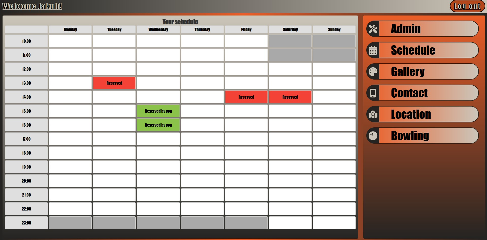

W harmonogramie każde pole oznacza jedną jednostkę czasu i może mieć jeden z kilku stanów:

- **wolne - białe** – dostępne do rezerwacji,
- **niedostępne - szare** – poza godzinami otwarcia,
- **zarezerwowane przez ciebie - zielone** – wyróżnione wizualnie,
- **zarezerwowane przez innych użytkowników - czerwone**.

Rezerwacja odbywa się przez jedno kliknięcie w wolne pole. Nad harmonogramem widnieje imię zalogowanego użytkownika (dane z sesji), a w prawym górnym rogu dostępna jest opcja wylogowania.

## 🧭 Nawigacja i interfejs

Aplikacja zawiera boczny panel nawigacyjny (sidebar), który w wersji mobilnej przesuwa się do dolnej części ekranu. W trybie mobilnym pojawia się także przycisk burger menu, umożliwiający ukrywanie lub pokazywanie menu.

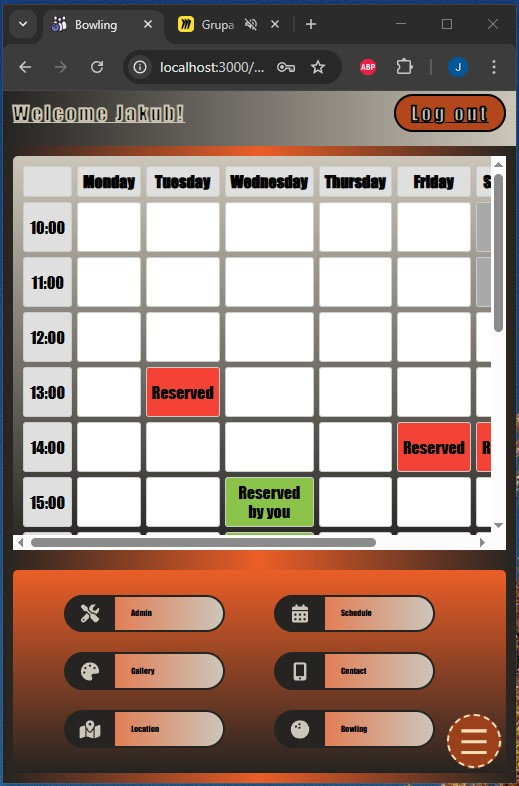

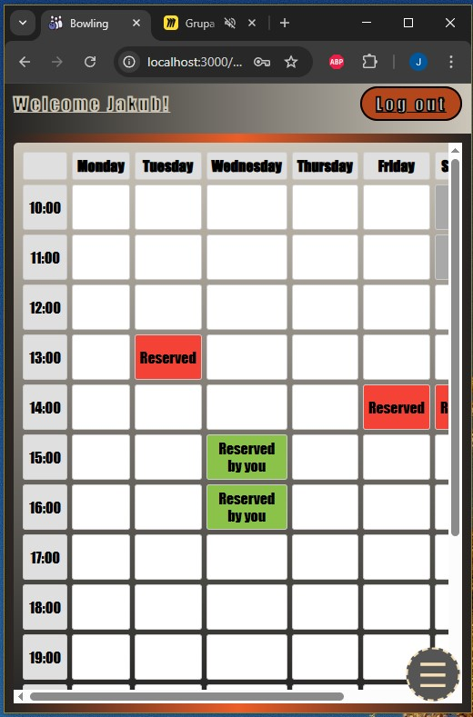

## 📋 Sekcje dostępne z poziomu menu

- **Schedule** – domyślny widok po zalogowaniu z harmonogramem i możliwością rezerwacji.
- **Admin** – dostępny tylko dla użytkowników z rolą `Admin`. Pozwala przeglądać wszystkich użytkowników systemu, ich dane, zarządzać nimi (usuwanie, przeglądanie ich rezerwacji, usuwanie rezerwacji).

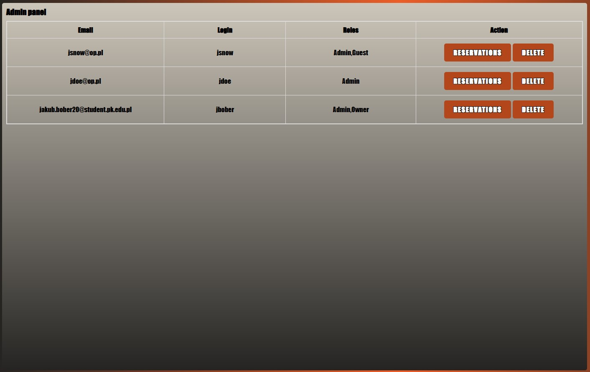

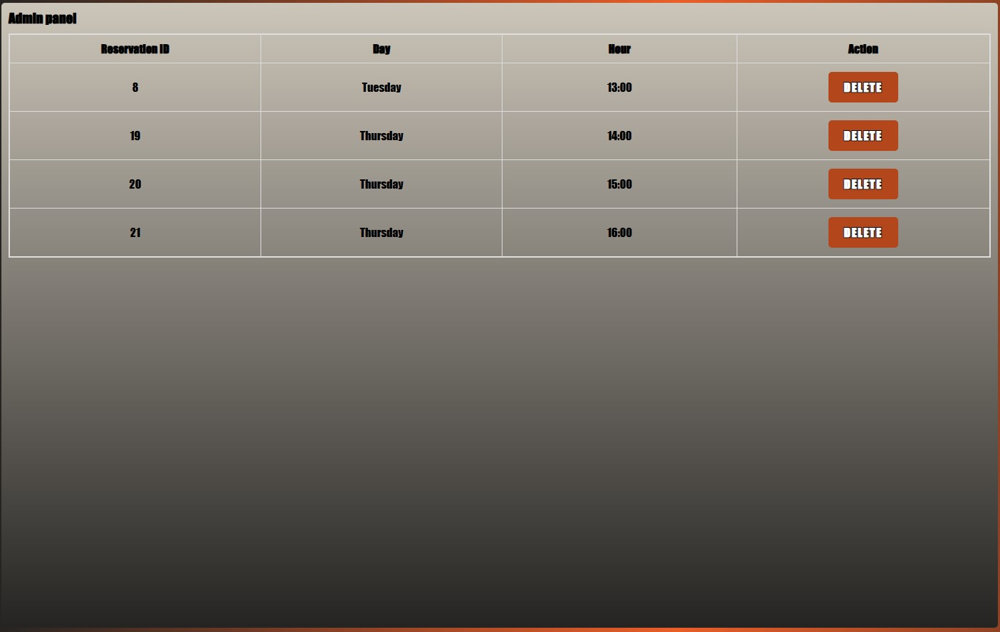

- **Gallery** – przesuwana galeria zdjęć związanych z kręgielnią.

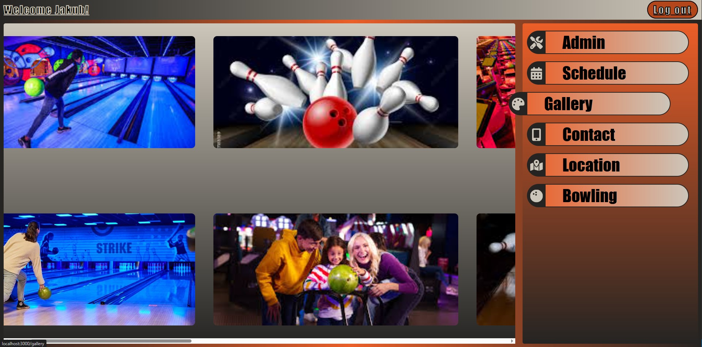

- **Contact** – dane kontaktowe: adres e-mail, numer telefonu, fizyczny adres, social media oraz godziny otwarcia.

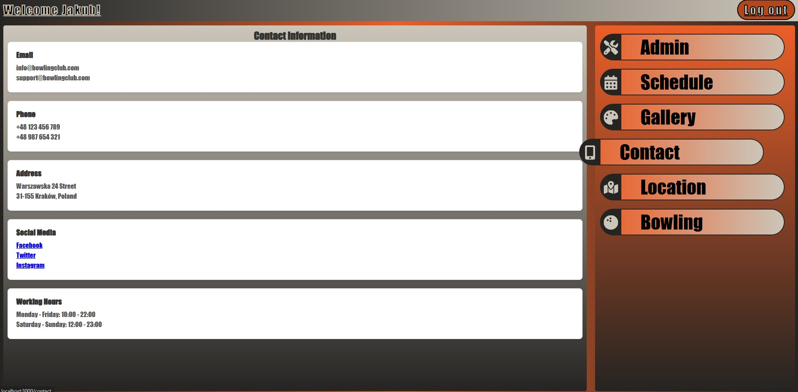

- **Location** – widok z mapą prezentującą lokalizację kręgielni.

- **Bowling** – sekcja z aktualnymi cenami za grę w kręgle.

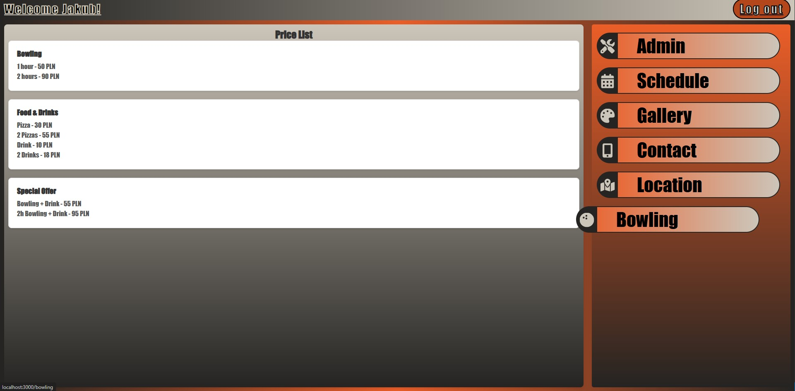

## 🧱 Architektura i wzorce

Projekt został zaprojektowany zgodnie z architekturą **Model-View-Controller (MVC)**, co pozwala na czytelne oddzielenie logiki aplikacji od warstwy prezentacji i danych. W warstwie modelu stosowane są klasy oparte o zasady SOLID, w tym jednoznaczna odpowiedzialność klas i iniekcja zależności.

Zastosowane zasady i wzorce:

- **SOLID** – każda klasa spełnia zasadę pojedynczej odpowiedzialności, a komponenty systemu są luźno powiązane.
- **KISS (Keep It Simple, Stupid)** – prosta, intuicyjna logika aplikacji.
- **Singleton** – zastosowany do kontrolowania instancji połączenia z bazą danych, zapewniając spójność i kontrolę zasobów.

## 🛠 Technologie

- **Backend**: PHP 
- **Frontend**: HTML, CSS, JavaScript
- **Baza danych**: PostgreSQL + Phinx Migrations
- **Serwer aplikacji**: Nginx + PHP-FPM

Dodatkowo stawiany jest Adminer do wygodnej obsługi bazy danych na porcie 8080.
Poświadczenia do Adminera:
- Rodzaj bazy - PostgreSQL
- Serwer - db
- Login - admin
- Hasło - admin
- Baza danych - bowling_club

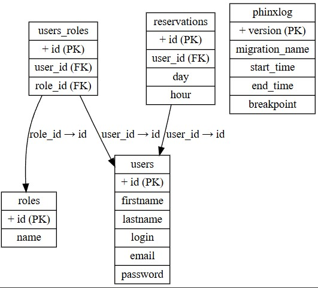

---
